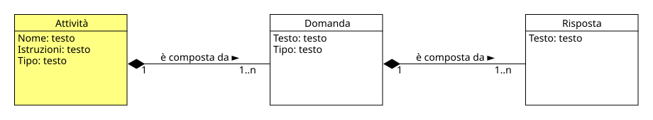

!!! info "Permessi e Ruoli"
    * **Gestisce (crea, modifica, elimina):** :material-account-hard-hat: Progettista
    * **Visualizza:** :material-account-hard-hat: Progettista, :material-shield-account: Moderatore, :material-account: Testato, :material-account-tie: Esperto

Nel progetto concettuale un'attività ha diversi attributi che la identificano:

* **Nome** :material-arrow-right-thin: rappresenta il nome dell'attività, che deve essere univoco all'interno del progetto
* **Istruzioni** :material-arrow-right-thin: rappresentano le istruzioni che il testato deve seguire per completare l'attività
* **Tipo** :material-arrow-right-thin: rappresenta la tipologia di appartenenza dell'attività (es. Riconoscere un modello tipico, Stile cognitivo ecc.)

Essa è costituita da una o più [domande](questions_and_responses.md) a loro volta costituite da una o più [risposte](questions_and_responses.md) secondo il seguente schema:

  

> [!IMPORTANTE]
> Un'attività ha un rapporto di composizione <strong>Composizione</strong> 
> In UML è una relazione strutturale di tipo "tutto-parte" molto forte, in cui la classe contenitore possiede e controlla totalmente il ciclo di vita degli oggetti contenuti. 
>   
> con le domande, questo significa che se essa viene eliminata, anche tutte le domande di cui è composta verrano eliminate.

> [!ESEMPIO]
> **Nome**: Questionario sulle teorie dell'intelligenza
>
> **Tipo**: Stile cognitivo
>
> **Istruzioni**: Leggi ogni frase riportata qui sotto e poi fai una crocetta solo nel quadratino che indica quanto sei d'accordo con l'affermazione.
>
> **Domanda 1**: La tua intelligenza è qualcosa di te che non puoi cambiare.
>
> **Risposte**:
> * [ ] 1a. D'accordo
> * [ ] 1b. Un po' d'accordo
> * [ ] 1c. Un po' contrario
> * [x] 1d. Contrario
>
> **Domanda 2**: Puoi imparare cose nuove, ma non puoi cambiare la tua intelligenza.
>
> **Risposte**:
> * [ ] 2a. D'accordo
> * [x] 2b. Un po' d'accordo
> * [ ] 2c. Un po' contrario
> * [ ] 2d. Contrario

***

## Moodle
In Moodle, non esiste un concetto di Attività nella quale è possibile inserire una o più domande, tuttavia è possibile avere una rappresentazione molto simile attraverso le **Categorie** gestibili nel [deposito delle domande](activity_collection.md), che permettono di raggruppare serie di domande.

Il meccanismo è molto semplice, il Progettista:material-account-hard-hat: per ogni attività che ha definito nel progetto, crea una categoria nel [deposito delle domande](activity_collection.md) e all'interno di questa categoria inserisce tutte le domande che fanno parte dell'attività stessa.

### Creare una nuova attività
Per creare una nuova attività è importante che l'utente sia all'interno di un [deposito delle domande](activity_collection.md) esistente.
A questo punto i passi sono:

1. Nel menù a tendina in alto a sinistra scegliere **Categorie**
1. Cliccare sul pulsante **Aggiungi categoria** e compilare i campi:

    * **Categoria genitore** :material-arrow-right-thin: rappresenta a quale categoria si vuole inserire l'attività
    * **Nome** :material-arrow-right-thin: rappresenta il nome della nuova categoria
    * **Informazioni categoria (opzionale)** :material-arrow-right-thin: rappresenta la descrizione della nuova attività

> [!TIP]
> Per una migliore organizzazione delle attività si consiglia di creare una categoria padre contenente tutte le attività concettualmente simili (stesso tipo) e al suo interno sotto-categorie per ogni attività, in questo modo sarà più semplice la loro ricerca.

> [!ESEMPIO]
> 1. Considerando che Moodle dispone già di un deposito a livello di sistema, si può creare una nuova attività in questo modo:
>
>     * **Categoria genitore**: Primo livello di sistema
>     * **Nome**: Stile cognitivo
>     * **Informazioni categoria (opzionale)**: La seguente categoria contiene tutte le attività che contengono domande relative allo stile cognitivo.
>
> 1. Successivamente, all'interno dell'attività appena creata, il Progettista:material-account-hard-hat: potrà creare nuove sotto-categorie per ogni attività specifica, ad esempio:
>
>     * **Categoria genitore**: Stile cognitivo
>     * **Nome**: Questionario sulle teorie dell'intelligenza
>     * **Informazioni categoria (opzionale)**: La seguente categoria contiene tutte le domande relative al questionario sulle teorie dell'intelligenza.
>
> 1. In questa nuova sotto-categoria appena creata, il Progettista:material-account-hard-hat: inserirà tutte le domande che fanno parte dell'attività.

### Modificare un'attività
Per modificare un'attività è importante che l'utente sia all'interno del [deposito delle domande](activity_collection.md).

1. Nel menù a tendina in alto a sinistra scegliere **Categorie**
1. Scorrere la lista delle attività fino a trovare quella che si vuole modificare e premere il menù a tre puntini
1. All'interno del menù selezionare **Impostazioni ** e modificare i campi desiderati.

### Eliminare un'attività
Per eliminare un'attività è importante che l'utente sia all'interno del [deposito delle domande](activity_collection.md).

1. Nel menù a tendina in alto a sinistra scegliere **Categorie**
1. Scorrere la lista delle attività fino a trovare quella che si vuole eliminare e premere il menù a tre puntini
1. All'interno del menù selezionare **Elimina ** e confermare l'eliminazione dell'attività.
