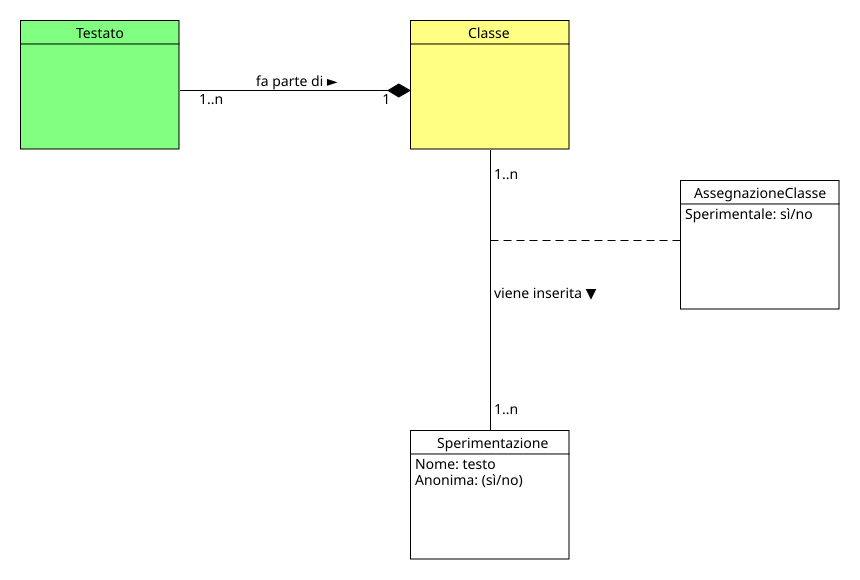

!!! info "Permessi e Ruoli"
    * **Gestisce (crea, modifica, elimina):** :material-account-hard-hat: Progettista
    * **Visualizza:** :material-account-hard-hat: Progettista, :material-shield-account: Moderatore

Nel progetto concettuale una classe rappresenta l'insieme di utenti **Testati:material-account:** che saranno assegnati alle sperimentazioni. 

  

Una classe può agire come gruppo sperimentale (i cui dati sono validi per lo studio) o come gruppo di controllo (non sperimentale). Questo stato, tuttavia, è legato esclusivamente alla specifica sperimentazione a cui la classe partecipa, rendendolo di fatto una proprietà della relazione e non dell'entità Classe. Nel modello di dominio, questa dinamica è gestita tramite la Classe Associativa **AssegnazioneClasse**, progettata appositamente per definire la natura del vincolo tra la classe e la sperimentazione, perciò in fase di assegnazione di una classe a una sperimentazione, il **Progettista:material-account-hard-hat:** dovrà specificare se la classe è un gruppo sperimentale o di controllo.

## Moodle
In Moodle, il concetto di Classe è rappresentato dal **Gruppo globale**, che permette di raggruppare un insieme di utenti. 
I gruppi globali, come dice il nome, sono visibili a livello di sistema e non sono legati a un corso Moodle specifico, permettendo, quindi, di essere assegnati a più corsi.

### Creare una nuova classe
> [!TIP]
> È possibile creare più classi contemporaneamente tramite un file CSV (vedi [Creare più classi contemporaneamente](csv.md#creare-piu-classi-contemporaneamente)).

I passi da seguire sono:

1. Accedere alla pagina **Amministrazione del sito** di Moodle
1. Cliccare su **Utenti** nel menù centrale
1. Nella sezione **Profili** cliccare su **Gruppi globali**
1. Nella pagina che si apre spostarsi in **Aggiungi gruppo globale** e compilare i seguenti campi:

    * **Nome** :material-arrow-right-thin: rappresenta il nome del gruppo che sarà visibile agli utenti
    * **Contesto** :material-arrow-right-thin: rappresenta il livello del gruppo, che deve essere impostato su **Sistema**
    * **Codice identificativo gruppo globale** :material-arrow-right-thin: rappresenta l'identificativo del gruppo è sarà utilizzato per assegnare gli utenti al gruppo stesso tramite CSV file

1. Cliccare su **Salva modifiche** per terminare la creazione.

### Modificare una classe
I passi da seguire sono:

1. Accedere alla pagina **Amministrazione del sito** di Moodle
1. Cliccare su **Utenti** nel menù centrale
1. Nella sezione **Profili** cliccare su **Gruppi globali**
1. Nella pagina che si apre spostarsi in **Gruppi globali a livello di sistema**, nella riga del gruppo da modificare cliccare sul menù  e scegliere **Modifica **
1. Modificare i campi desiderati e cliccare su **Salva modifiche** per terminare la modifica della classe.

### Eliminare una classe
I passi da seguire sono:

1. Accedere alla pagina **Amministrazione del sito** di Moodle
1. Cliccare su **Utenti** nel menù centrale
1. Nella sezione **Profili** cliccare su **Gruppi globali**
1. Nella pagina che si apre spostarsi in **Gruppi globali a livello di sistema**, nella riga del gruppo da eliminare cliccare sul menù  e scegliere **Modifica **
1. Nella pagina che si apre, confermare l'eliminazione della classe cliccando sul pulsante **Elimina**.

### Assegnare o rimuovere un utente da una classe

> [!TIP]
> È possibile assegnare gli utenti alle classi direttamente tramite un file CSV (vedi [Creare o aggiornare più utenti contemporaneamente](csv.md#creare-o-aggiornare-piu-utenti-contemporaneamente)).

I passi da seguire sono:

1. Accedere alla pagina **Amministrazione del sito** di Moodle
1. Cliccare su **Utenti** nel menù centrale
1. Nella sezione **Profili** cliccare su **Gruppi globali**
1. 1. Nella pagina che si apre spostarsi in **Gruppi globali a livello di sistema**, scegliere un gruppo e nella sua rigacliccare sul menù  e scegliere **Assegna **
1. A questo punto, è possibile rimuovere o aggiungere utenti spostandoli tra il riquadro a sinistra (utenti assegnati al gruppo) e quello a destra (utenti disponibili) utilizzando i pulsanti **Aggiungi** e **Rimuovi**.

