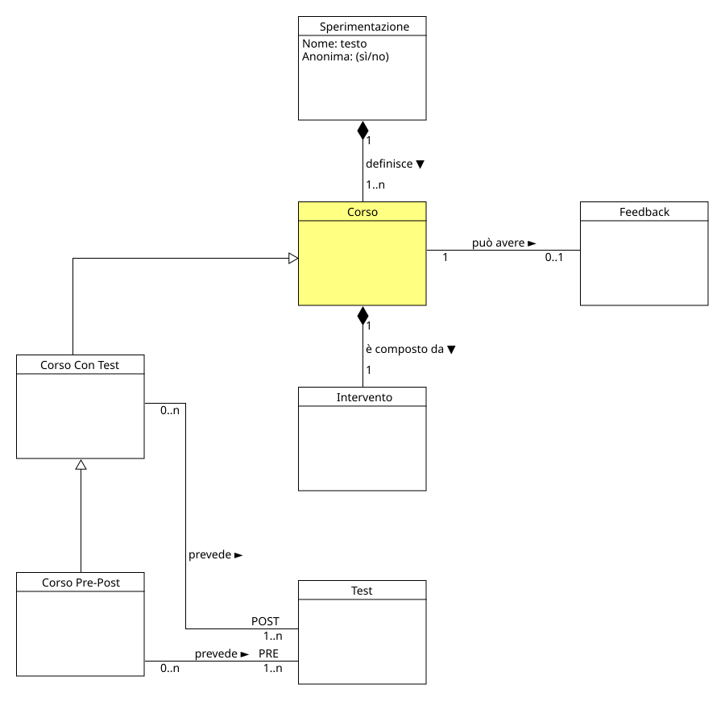

!!! info "Permessi e Ruoli"
    * **Gestisce (crea, modifica, elimina):** :material-account-hard-hat: Progettista
    * **Visualizza:** :material-account-hard-hat: Progettista, :material-shield-account: Moderatore, :material-account-tie: Esperto

Nel progetto concettuale un corso rappresenta la metodologia secondo la quale verranno eseguiti i test e presentati gli interventi. 
L'obiettivo dello studio, infatti, è quello di valutare l'efficacia di un determinato intervento

  

## Moodle
In Moodle, esiste il concetto di Corso, ma non si allinea perfettamente con quello del progetto concettuale (già assegnato alla [Sperimentazione](experiment.md)). 
Il problema principale era identificare un oggetto/elemento di Moodle che permettesse di raggruppare più test (e interventi) pur rimanendo all'interno della stessa Sperimentazione. La soluzione è stata quella di utilizzare la **Sezione** di un Corso di Moodle. Il Progettista:material-account-hard-hat: per ogni corso che ha definito nel progetto, creerà una nuova sezione all'interno della Sperimentazione e all'interno di essa inserirà tutti i test (e interventi) che fanno parte del corso stesso.

> [!ATTENZIONE]
> Nelle sezioni successive verranno utilizzati i termini del progetto concettuale, quindi il termine **Corso** indicherà una **Sezione** di un Corso di Moodle e il termine **Sperimentazione** indicherà un **Corso** di Moodle. 
> In ogni caso, per evitare confusione, visualizzare la tabella di corrispondenza tra i termini del progetto concettuale e quelli di Moodle nella sezione [Mapping](mapping.md).

## Definire un nuovo corso
Per definire un nuovo corso è importante che il Progettista:material-account-hard-hat: sia all'interno di una [Sperimentazione](experiment.md) esistente.

I passi da seguire sono:

1. Accedere a **I miei corsi** nel menù centrale e selezionare la **Spermimentazione** nella quale si vuole creare il nuovo corso
1. In alto a destra cliccare sul pulsante **Modalità modifica**, appariranno diverse nuove "zone" modificabili all'interno della pagina
1. Cliccare in fondo alla pagina sul pulsante **Aggiungi sezione**
1. A questo punto, cliccando sul simbolo della matita **** a fianco al titolo del nuovo corso, sarà possibile modificarne il nome

## Modificare un corso 
Per definire un nuovo corso è importante che il Progettista:material-account-hard-hat: sia all'interno di una [Sperimentazione](experiment.md) esistente.

I passi da seguire sono:

1. In alto a destra, all'interno della **sperimentazione**, cliccare sul pulsante **Modalità modifica**, appariranno diverse nuove "zone" modificabili all'interno della pagina
1. Cliccare sul simbolo **** a destra del corso che si vuole modificare e nel menù che si aprirà cliccare su ** Modifica impostazioni**
1. Nella pagina che si aprirà sarà possibile modificare il nome del corso e altre impostazioni, come ad esempio la visibilità del corso stesso.
1. CLiccare sul pulsante **Salva modifiche** per salvare le modifiche effettuate.

## Eliminare un corso
Per eliminare un corso è importante che il Progettista:material-account-hard-hat: sia all'interno di una [Sperimentazione](experiment.md) esistente.

I passi da seguire sono:

1. In alto a destra, all'interno della **sperimentazione**, cliccare sul pulsante **Modalità modifica**, appariranno diverse nuove "zone" modificabili all'interno della pagina
1. Cliccare sul simbolo **** a destra del corso che si vuole modificare e nel menù che si aprirà cliccare su ** Elimina**
1. In caso di corso con elementi già presenti (come test o interventi), Moodle aprirà una finestra di conferma in cui sarà necessario confermare l'eliminazione.

## Aggiungere