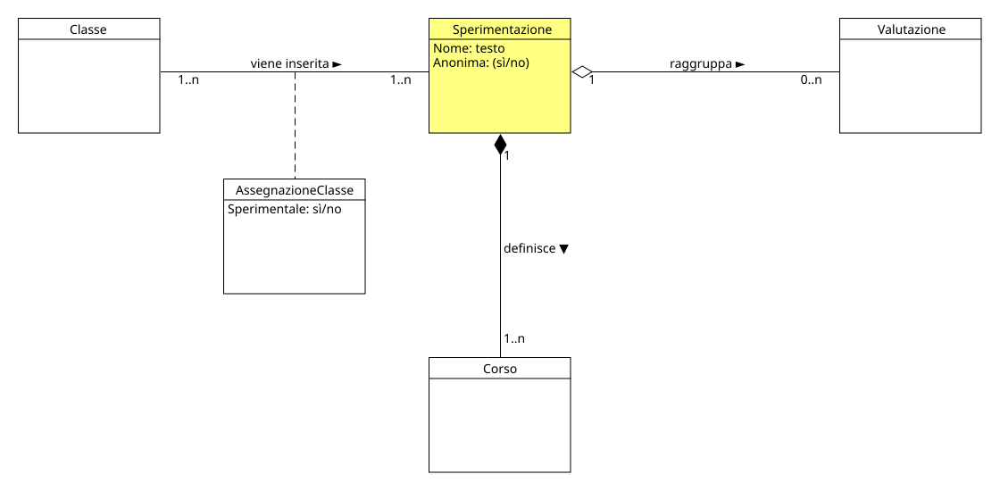

!!! info "Permessi e Ruoli"
    * **Gestisce (crea, modifica, elimina):** :material-account-hard-hat: Progettista
    * **Visualizza:** :material-account-hard-hat: Progettista

Nel progetto concettuale una sperimentazione rappresenta <u>l'obiettivo dello studio</u> ed ha diverse relazioni con altri elementi del progetto:

* **Composizione** <strong>Composizione</strong> 
In UML è una relazione strutturale di tipo "tutto-parte" molto forte, in cui la classe contenitore possiede e controlla totalmente il ciclo di vita degli oggetti contenuti. 
  
:material-arrow-right-thin: una sperimentazione è composta [corsi](course.md)
* **Aggregazione** <strong>Aggregazione</strong> 
In UML è una relazione strutturale di tipo "tutto-parte" debole, in cui la classe contenitore fa riferimento agli oggetti contenuti, ma non ne controlla il ciclo di vita, i quali possono esistere in modo indipendente. 
  
:material-arrow-right-thin: una sperimentazione può avere una o più [valutazioni](evaluation.md) associate
* **Associazione** <strong>Associazione</strong> 
In UML è una relazione strutturale di tipo "peer-to-peer", in cui le classi coinvolte comunicano e collaborano tra loro, ma non esiste alcun vincolo gerarchico o di ciclo di vita tra gli oggetti, i quali rimangono totalmente indipendenti. 
   :material-arrow-right-thin: una sperimentazione ha associate una o più [classi](class.md) di utenti

  

Ogni sperimentazione ha diversi attributi che la identificano:

* **Nome** :material-arrow-right-thin: rappresenta il nome della sperimentazione, che deve essere univoco all'interno del progetto
* **Anonimità** :material-arrow-right-thin: rappresenta se la sperimentazione è anonima o meno, ovvero se i dati raccolti saranno associati all'identità del testato o meno

## Moodle
In Moodle non esiste un concetto di Sperimentazione, l'elemento che più si avvicina è il Corso.

> [!ATTENZIONE]
> Il **Corso** di Moodle non è equivalente al **Corso** del progetto concettuale!

Come definito precedentemente nel progetto concettuale, una Sperimentazione dovrebbe poter essere anonima oppure no, purtroppo in Moodle non è possible definire un Corso come anonimo.

### Creare una nuova sperimentazione
Per creare una nuova sperimentazione, il meccanismo è molto semplice, il progettista:material-account-hard-hat: deve seguire questi passi:

- Accede alla Home di Moodle e clicca sul pulsante **Aggiungi corso** (oppure clicca sul pulsante **I miei corsi** del menù e poi su **Crea corso**)

**DEFINIRE COSA è MEGLIO: SPERIMENTAZIONE = CORSO OPPURE SPERIMENTAZIONE = CATEGORIA**