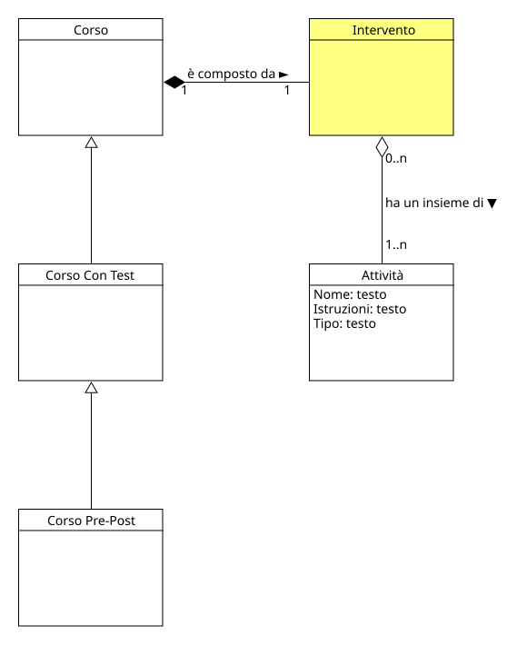

!!! info "Permessi e Ruoli"
    * **Gestisce (crea, modifica, elimina):** :material-account-hard-hat: Progettista
    * **Visualizza:** :material-account-hard-hat: Progettista, :material-account-tie: Esperto

Nel progetto concettuale, un intervento rappresenta del contenuto didattico che viene presentato al testato:material-account: da parte dell'esperto:material-account-tie:. 
È costituito da una o più [attività](activity.md) e fa parte di un [corso](course.md).

  

In un [corso](course.md) di tipo **Pre-Post**, l'intervento è l'elemento che viene presentato tra il pre-test e il post-test 