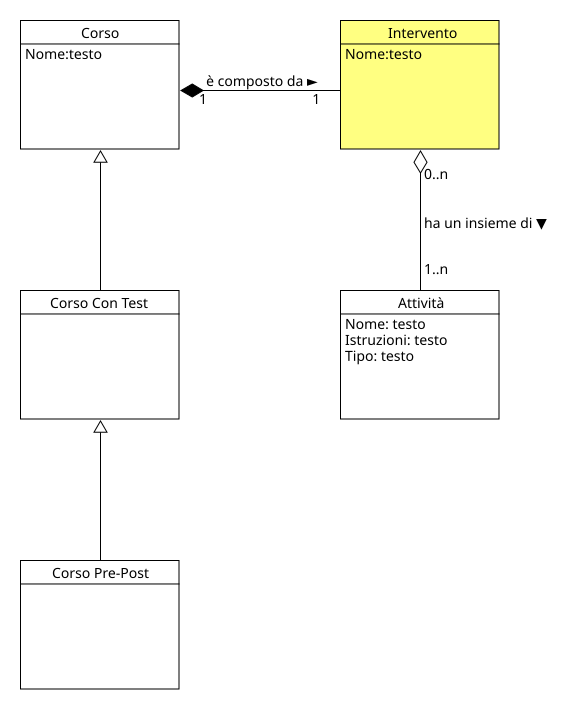

!!! info "Permessi e Ruoli"
    * **Gestisce (crea, modifica, elimina):** :material-account-hard-hat: Progettista
    * **Visualizza:** :material-account-hard-hat: Progettista, :material-account-tie: Esperto

Nel progetto concettuale, un intervento rappresenta del contenuto didattico che viene presentato al testato:material-account: da parte dell'esperto:material-account-tie:. 
È costituito da una o più [attività](activity.md) e fa parte di un [corso](course.md).

  

## Moodle
In Moodle, un intervento viene creato e gestito come un [Test](test.md), semplicemente le attività contenute in esso non saranno eseguite, ma saranno visualizzate come contenuto didattico da parte dell'esperto:material-account-tie: 

> [!IMPORTANTE]
> In fase di creazione e gestione di un intervento, non sono importanti i campi che riguardano la valutazione o il punteggio, bisogna rispettare soltanto l'ordine delle attività e la loro visualizzazione.

### Creare un nuovo intervento
Per creare un nuovo intervento è importante che il Progettista:material-account-hard-hat: sia all'interno di una [sperimentazione](experiment.md) e che esista il [corso](course.md) in cui si vuole creare l'intervento.

I passi da seguire sono:

1. Accedere al [corso](course.md) in cui si vuole aggiungere l'intervento
1. In alto a destra, cliccare sul pulsante **Modalità modifica**, appariranno diverse nuove "zone" modificabili all'interno della pagina
1. A questo punto verranno mostrati diversi campi da compilare, di seguito l'elenco, suddiviso per categoria:
    
    * **Generale**
        - **`Nome`** :material-arrow-right-thin: rappresenta il nome dell'intervento, che deve essere univoco all'interno del corso
        - **`Descrizione`** :material-arrow-right-thin: breve descrizione dell'intervento
    * **Impaginazione**
        - **`Metodo di navigazione`** :material-arrow-right-thin: in che modo l'esperto può navigare tra le domande dell'intervento
    * **Comportamento domanda**
        - **`Alternative in modo casuale`** :material-arrow-right-thin: se le domande dell'intervento devono essere mostrate in ordine casuale o meno
    * **Condizioni per l'accesso**
        - **`Criteri di accesso`** :material-arrow-right-thin: permette di aggiungere condizioni per l'accesso all'intervento

1. Cliccare sul pulsante **Salva e visualizza** per salvare le impostazioni dell'intervento e passare alla pagina di visualizzazione delll'intervento stesso.

### Modificare un intervento
Per modificare un intervento è importante che il Progettista:material-account-hard-hat: sia all'interno del [corso](course.md) in cui si vuole modificarlo.

I passi da seguire sono:

1. Cliccare sul nome dell'intervento che si vuole modificare, in questo modo si aprirà la pagina di visualizzazione dell'intervento stesso
1. Nel menù in alto, cliccare su **Impostazioni**
1. Nella pagina che viene mostrata, modificare i campi che si vogliono cambiare e cliccare sul pulsante **Salva e visualizza** per salvare le modifiche effettuate.

### Eliminare un intervento
Per eliminare un intervento è importante che l'utente sia all'interno del [corso](course.md) in cui si vuole eliminarlo.

I passi da seguire sono:

1. In alto a destra, all'interno della **sperimentazione**, cliccare sul pulsante **Modalità modifica**, appariranno diverse nuove "zone" modificabili all'interno della pagina
1. Cliccare sul simbolo **** a destra dell'intervento che si vuole eliminare e nel menù che si aprirà cliccare su ** Elimina**
1. Nella finestra di conferma che si aprirà, cliccare sul pulsante **Elimina** per confermare l'eliminazione dell'intervento.

### Aggiungere un'attività a un intervento
Per aggiungere un'[attività](activity.md) a un intervento è importante il Progettista:material-account-hard-hat: sia all'interno dell'intervento in cui si vuole aggiungere l'attività e che esistano una serie di attività già definite nel [deposito delle domande](activity_collection.md).

I passi da seguire sono:

1. Nel menù in alto dell'intervento, cliccare su **Domande**
1. Nella pagina, cliccare il menù a tendina **Aggiungi** e selezionare **dal deposito domande**
1. Nella finestra che si aprirà, filtrare l'attività che si vuole aggiungere e cliccare su **Applica filtri**
1. Spuntare tutte le domande all'interno dell'attività e premere **Aggiungi al quiz le domande selezionate** per aggiungere l'attività all'intervento.

> [!TIP]
> È possibile aggiungere o rimuovere pagine di un intervento cliccando, rispettivamente, sui simboli **** e **** a sinistra dello spazio tra una domanda e l'altra. 

### Rimuovere un'attività da un intervento
Per rimuovere un'[attività](activity.md) da un intervento è importante il Progettista:material-account-hard-hat: sia all'interno dell'intervento in cui si vuole rimuovere l'attività.

I passi da seguire sono:

1. Nel menù in alto dell'intervento, cliccare su **Domande**
1. Nella pagina, cliccare su pulsante **Seleziona più elementi** e spuntare tutte le domande dell'attività che si vuole rimuovere
1. Cliccare sul pulsante **Elimina selezionati** per rimuovere l'attività dall'intervento