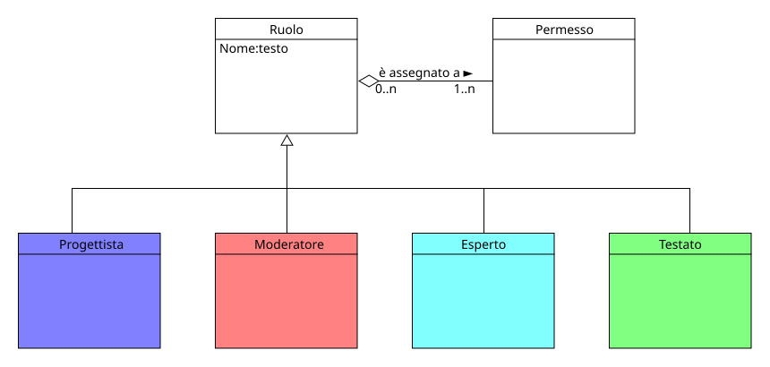

!!! info "Permessi e Ruoli"
    * **Gestisce (crea, modifica, elimina):** :material-account-hard-hat: Progettista
    * **Visualizza:** :material-account-hard-hat: Progettista

Il ruolo è un insieme di autorizzazioni (o permessi) che definiscono le azioni che un utente può o non può fare all'interno del sistema. 
Un utente che ottiene un determinato ruolo, acquisisce le responsabilità associata all'attore identificato nella fase di progettazione.

> [!ESEMPIO]
> Nel progetto concettuale è stato individuato l'attore **Testato:material-account:** come colui che deve svolgere i test, quindi concettualmente un utente che ottiene il ruolo di Testato, acquisisce le responsabilità associate a questo attore e, di conseguenza, potrà svolgere i test.

  

## Moodle
Il concetto di **ruolo** in Moodle è identico a quello del progetto astratto.

> [!IMPORTANTE]
> Il **Progettista** in Moodle è rappresentato dal ruolo di **Amministratore**, che viene generato e assegnato automaticamente al momento dell'installazione del sistema, quindi non è necessario creare un nuovo ruolo per esso.

### Creare un nuovo ruolo in Moodle
Per creare un nuovo ruolo in Moodle è necessario rispettare alcune precondizioni:

* Nel sistema devono esistere una serie di autorizzazioni assegnabili (in Moodle sono definite come **Permessi**), che rappresentano le azioni che un utente può compiere all'interno del sistema. Queste autorizzazioni sono già presenti in Moodle, quindi non è necessario crearne di nuove.

Di seguito i passi per creare un nuovo ruolo in Moodle:

1. Accedere alla Home page di Moodle
1. Cliccare su **Amministrazione del sito** nel menù centrale
1. Nel menù orizzontale scegliere **Utenti > Autorizzazioni > Gestione Ruoli**
1. Cliccare su **Aggiungi un ruolo**
1. Inserire gli attributi che identificano il ruolo:

    * **Nome abbreviato** :material-arrow-right-thin: es. "moderatore" rappresenta l'identificativo del ruolo
    * **Nome personalizzato** :material-arrow-right-thin: es. "Moderatore" rappresenta il nome del ruolo che sarà visibile agli utenti
    * **Descrizione personalizzata** :material-arrow-right-thin: es. "Ruolo che permette di moderare i test" rappresenta la descrizione del ruolo che sarà visibile agli utenti
    * **Ruolo archetipo (opzionale)** :material-arrow-right-thin: es. "Docente (non editor)" un archetipo rappresenta un ruolo predefinito che può essere utilizzato come modello per quello nuovo, in questo caso il ruolo di Docente (non editor) è il più simile a quello di Moderatore
    * **Contesti dove questo ruolo può essere assegnato** :material-arrow-right-thin: es. "Sistema" rappresenta il contesto in cui il ruolo può essere assegnato, in questo caso il contesto di Sistema permette di assegnare il ruolo a livello globale, quindi indipendentemente dalla Sperimentazione e/o dal Corso selezionato.

1. Una volta inseriti gli attributi, si devono assegnare le autorizzazioni (permessi) al ruolo spuntando **consenti** sulle quelle desiderate.
1. Per terminare la creazione del ruolo, scorrere in fondo alla pagina e cliccare su **Salva modifiche**.

### Modificare o eliminare un ruolo in Moodle
Per modificare o eliminare un ruolo in Moodle il procedimento è molto semplice, in entrambi i casi è necessario accedere alla pagina di gestione dei ruoli:

1. Accedere alla Home page di Moodle
1. Cliccare su **Amministrazione del sito** nel menù centrale
1. Nel menù orizzontale scegliere **Utenti > Autorizzazioni > Gestione Ruoli**

A questo punto:

* **MODIFICARE**: Cliccare sull'icona della matita  a fianco al ruolo desiderato, modificare gli attributi e/o le autorizzazioni e cliccare su **Salva modifiche**
* **ELIMINARE**: Cliccare sull'icona del cestino  a fianco al ruolo desiderato e confermare l'eliminazione del ruolo.

### Assegnare o rimuovere un ruolo a un utente in Moodle
Per assegnare o rimuovere un ruolo a un utente in Moodle è necessario rispettare alcune precondizioni:

* L'utente a cui si vuole assegnare il ruolo deve essere già registrato nel sistema, in quanto non è possibile assegnare un ruolo a un utente non esistente.

Di seguito i passi per assegnare o rimuovere un ruolo a un utente in Moodle:

1. Accedere alla Home page di Moodle
1. Cliccare su **Amministrazione del sito** nel menù centrale
1. Nel menù orizzontale scegliere **Utenti > Autorizzazioni > Ruoli globali**
1. Nella pagina che si apre, cliccare sul ruolo desiderato, si aprirà una nuova pagina con due colonne, a destra gli utenti disponibili e a sinistra gli utenti assegnati al ruolo.
1. Per assegnare il ruolo a un utente, selezionarlo nella colonna di destra e cliccare su **Aggiungi**, in questo modo l'utente selezionato passerà nella colonna di sinistra e avrà il ruolo assegnato (per rimuoverlo basta selezionarlo nella colonna di sinistra e cliccare su **Rimuovi**).