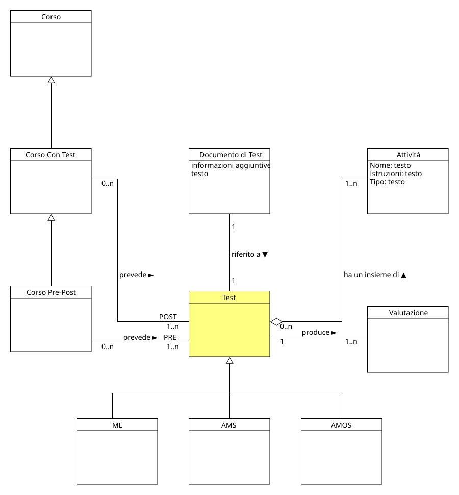

!!! info "Permessi e Ruoli"
    * **Gestisce (crea, modifica, elimina):** :material-account-hard-hat: Progettista
    * **Visualizza:** :material-account-hard-hat: Progettista, :material-shield-account: Moderatore, :material-account: Testato

Nel progetto concettuale un test è lo strumento attraverso il quale vengono somministrate le attività ai testati per poter, successivamente, raccogliere le risposte. 
Un test è costituito da una o più [attività](activity.md), appartiene a un [corso](course.md) e produce una [valutazione](evaluation.md) per ogni testato che lo completa.

  

Nel modello di dominio, un test è una classe generale che si specializza in diverse sottoclassi, ognuna delle quali rappresenta un diverso tipo di test:

* **Test di tipo Machine Learning (ML)** :material-arrow-right-thin: rappresenta un test che contiene attività di tipo Machine Learning (es. Zombus, Frankie)
* **Test di tipo Attribution of Mental States (AMS)** :material-arrow-right-thin: rappresenta un test utilizzato per valutare in che modo un testato percepisce e attribuisce stati mentali a un computer
* **Test di tipo Abilità e Motivazione allo Studio (AMOS)** :material-arrow-right-thin: rappresenta un test utilizzato per valutare quanto un testato apprende, soprattutto in ambito scolastico, ed è motivato nello studio

> [!INFORMAZIONI-AGGIUNTIVE] Informazioni aggiuntive
> Le sottoclassi di test che sono state identificate durante la progettazione concettuale, sono state definite in base alle esigenze del progetto. È possibile, in futuro, aggiungere nuove tipologie di test senza dover modificare la struttura del modello di dominio, in quanto il concetto di test è generico e può essere esteso.

A ogni test è associato un [documento di test](test_document.md) che contiene la descrizione di tutte le attività che lo compongono, le istruzioni per il testato ed eventuali informazioni aggiuntive per il Moderatore:material-shield-account: che lo gestisce.

## Moodle
Durante lo studio del progetto, sono state fatte diverse prove per capire come rappresentare al meglio un test.
In Moodle, ci si è focalizzati soprattutto sul 
**modulo** <strong>Modulo</strong> 
In Moodle, un modulo è un blocco funzionale che serve ad aggiungere contenuti, risorse o attività didattiche all'interno di un corso (sperimentazione) 
  
[**Quiz**](<https://docs.moodle.org/35/it/Guida_rapida_Quiz>), 
perchè permette una discreta libertà di configurazione offrendo diverse tipologie di attività tra cui scegliere.

### Creare un nuovo test
Per creare un nuovo test è importante che il Progettista:material-account-hard-hat: sia all'interno di una [sperimentazione](experiment.md) e che esista il [corso](course.md) in cui si vuole creare il test.

I passi da seguire sono:

1. In alto a destra, all'interno della **sperimentazione**, cliccare sul pulsante **Modalità modifica**, appariranno diverse nuove "zone" modificabili all'interno della pagina
1. Cliccare sul pulsante **Aggiungi un'attività o una risorsa** all'interno del corso nel quale si vuole creare il test e selezionare **Quiz**
1. A questo punto verranno mostrati diversi campi da compilare, di seguito l'elenco, suddiviso per categoria:
    
    > [!ATTENZIONE]
    > In fase di creazione del test, i campi che Moodle propone sono molti di più di quelli che verranno elencati qui sotto, tuttavia per il progetto concettuale bastano soltanto quelli descritti. 
    > Gli altri campi possono essere lasciati con le impostazioni di default oppure adattarli ad eventuali eccezioni che il progettista ritiene necessarie per il test stesso.

    * **Generale**
        - **`Nome`** :material-arrow-right-thin: rappresenta il nome del test, che deve essere univoco all'interno del corso
        - **`Descrizione`** :material-arrow-right-thin: breve descrizione del test
    * **Valutazione**
        - **`Tentativi permessi`** :material-arrow-right-thin: il numero di tentativi che il testato può fare
    * **Impaginazione**
        - **`Metodo di navigazione`** :material-arrow-right-thin: in che modo il testato può navigare tra le domande del test
    * **Comportamento domanda**
        - **`Alternative in modo casuale`** :material-arrow-right-thin: se le domande del test devono essere mostrate in ordine casuale o meno
    * **Opzioni di revisione**
        - In questa sezione è possibile definire in che modo il testato può revisionare le domande e le risposte del test
    * **Condizioni per l'accesso**
        - **`Criteri di accesso`** :material-arrow-right-thin: permette di aggiungere eventuali condizioni per l'accesso al test

1. Cliccare sul pulsante **Salva e visualizza** per salvare le impostazioni del test e passare alla pagina di visualizzazione del test stesso.

> [!ESEMPIO]
> In questo esempio, verrà mostrato come compilare i campi di un eventuale test sul machine learning per rimanere in linea con le richieste del progetto concettuale:
>
>    * **Generale**
>        - **`Nome`** :material-arrow-right-thin: Pre-Test Zombus
>        - **`Descrizione`** :material-arrow-right-thin: il seguente test propone una serie di attività volte a comprendere la percezione del Machine Learning da parte dei testati, in particolare per quanto riguarda il riconoscimento di modelli tipici e la valutazione di stili cognitivi. Sarà seguito da un Post-Test.
>    * **Valutazione**
>        - **`Tentativi permessi`** :material-arrow-right-thin: 1
>    * **Impaginazione**
>        - **`Metodo di navigazione`** :material-arrow-right-thin: Sequenziale (il testato non può tornare indietro e modificare le risposte precedenti)
>    * **Comportamento domanda**
>        - **`Alternative in modo casuale`** :material-arrow-right-thin: No
>    * **Opzioni di revisione**
>        - Togliere tutte le spunte, in modo che il testato non possa revisionare le domande e le risposte del test
>    * **Condizioni per l'accesso**
>       - **`Criteri di accesso`** :material-arrow-right-thin: aggiunto criterio di accesso tramite l'appartenenza a una determinata **[Classe](class.md)** di utenti, in modo che solo i testati appartenenti a essa possano svolgere il test.

### Modificare un test
Per modificare un test è importante che il Progettista:material-account-hard-hat: sia all'interno del [corso](course.md) in cui si vuole modificarlo.

I passi da seguire sono:

1. Cliccare sul nome del test che si vuole modificare, in questo modo si aprirà la pagina di visualizzazione del test stesso
1. Nel menù in alto, cliccare su **Impostazioni**
1. Nella pagina che viene mostrata, modificare i campi che si vogliono cambiare e cliccare sul pulsante **Salva e visualizza** per salvare le modifiche effettuate.

### Eliminare un test
Per eliminare un test è importante che l'utente sia all'interno del [corso](course.md) in cui si vuole eliminarlo.

I passi da seguire sono:

1. In alto a destra, all'interno della **sperimentazione**, cliccare sul pulsante **Modalità modifica**, appariranno diverse nuove "zone" modificabili all'interno della pagina
1. Cliccare sul simbolo **** a destra del test che si vuole eliminare e nel menù che si aprirà cliccare su ** Elimina**
1. Nella finestra di conferma che si aprirà, cliccare sul pulsante **Elimina** per confermare l'eliminazione del test.

### Aggiungere un'attività a un test
Per aggiungere un'[attività](activity.md) a un test è importante il Progettista:material-account-hard-hat: sia all'interno del test in cui si vuole aggiungere l'attività e che esistano una serie di attività già definite nel [deposito delle domande](activity_collection.md).

I passi da seguire sono:

1. Nel menù in alto del test, cliccare su **Domande**
1. Nella pagina, cliccare il menù a tendina **Aggiungi** e selezionare **dal deposito domande**
1. Nella finestra che si aprirà, filtrare l'attività che si vuole aggiungere e cliccare su **Applica filtri**
1. Spuntare tutte le domande all'interno dell'attività e premere **Aggiungi al quiz le domande selezionate** per aggiungere l'attività al test.

> [!TIP]
> È possibile aggiungere o rimuovere pagine di un test cliccando, rispettivamente, sui simboli **** e **** a sinistra dello spazio tra una domanda e l'altra. 

### Rimuovere un'attività da un test
Per rimuovere un'[attività](activity.md) da un test è importante il Progettista:material-account-hard-hat: sia all'interno del test in cui si vuole rimuovere l'attività.

I passi da seguire sono:

1. Nel menù in alto del test, cliccare su **Domande**
1. Nella pagina, cliccare su pulsante **Seleziona più elementi** e spuntare tutte le domande dell'attività che si vuole rimuovere
1. Cliccare sul pulsante **Elimina selezionati** per rimuovere l'attività dal test