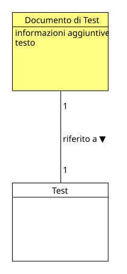

!!! info "Permessi e Ruoli"
    * **Gestisce (crea, modifica, elimina):** :material-account-hard-hat: Progettista
    * **Visualizza:** :material-account-hard-hat: Progettista, :material-shield-account: Moderatore

Nel progetto concettuale, un documento di test è la versione descrittiva di un [test](test.md). Esso, per ogni [attività](activity.md) che compone il test, aggiunge informazioni aggiuntive quali tempi di consegna, modalità ed eventuali istruzioni per il Moderatore:material-shield-account: che lo visualizza.

<p align="center">
  
</p>

Il documento di test fa riferimento a un unico test ed è vincolante, ovvero se il test viene modificato, anche il documento di test dovrà essere aggiornato.

## Moodle
Per integrare al meglio il concetto di documento di test in Moodle, come elemento che aggiunge informazioni alle attività di a un test, le opzioni possibili sono tre:

1. Creare un duplicato di un test esistente, aggiungere le informazioni in più necessarie e renderlo visibile solo al moderatore:material-shield-account:;
2. Creare un 
<span class="term">**modulo** <span class="tip"><strong>Modulo</strong><br>
In Moodle, un modulo è un blocco funzionale che serve ad aggiungere contenuti, risorse o attività didattiche all'interno di un corso (sperimentazione)<br>
</span> </span>
di tipo file, dove il progettista:material-account-hard-hat: può caricare un documento pre-compilato in formato PDF o Word contenente le informazioni aggiuntive;
3. Aggiungere le informazioni direttamente all'interno del test, ma renderli visibili solo al moderatore:material-shield-account:.

Sebbene le prime due opzioni (1. e 2.) siano valide, rischiano, però, di raddoppiare il lavoro del progettista:material-account-hard-hat: e di creare confusione, soprattutto, lavorando con molti test contemporaneamente.<br>
La terza opzione (3.), invece, sebbene non rispecchi pienamente il concetto di documento di test, si integra perfettamente in Moodle rendendo più semplice l'inserimento (injection) di informazioni aggiuntive all'interno di un test e la loro visualizzazione da parte del moderatore:material-shield-account:.<br>
Per questo motivo, **la terza opzione è stata scelta come soluzione**.

### Inserire informazioni aggiuntive in un test

> [!ATTENZIONE]
> Prima di iniziare, è obbligatorio che su Moodle sia stato installato il plugin [FilterCodes](plugin.md#filtercodes).

Il progettista:material-account-hard-hat: deve essere all'interno di un [test](test.md) esistente.

I passi da seguire sono:

1. Nel menù del test in alto, cliccare su **Domande** e poi selezionare la domanda che si vuole modificare
1. Nella pagina che si aprirà, le informazioni potranno essere aggiunte in tutti i campi di testo 
<span class="term">**TinyMCE** <span class="tip"><strong>TinyMCE</strong><br> 
TinyMCE è un  editor di testo rich-text in formato WYSIWYG (What You See Is What You Get, cioè "quello che vedi è quello che ottieni") che permette agli sviluppatori di aggiungere funzioni di scrittura avanzate ai siti web e alle applicazioni. 
</span> </span> (la dicitura "TinyMCE" è visibile in basso a destra del campo di testo). Ecco come strutturare un'informazione visibile solo al moderatore:material-shield-account::

    ```
    {ifcustomrole moderatore}

    Testo visibile solo al ruolo di Moderatore

    {/ifcustomrole}
    ```

    > [!IMPORTANTE]
    > Il termine che segue `ifcustomrole` rappresenta il **Nome abbreviato** di un [ruolo globale](role.md) su Moodle.

1. Salvare le modifiche cliccando sul pulsante **Salva modifiche** in fondo alla pagina.

!!! esempio "Esempio"
    === "Cosa scrivere nel campo delle istruzioni"

        **Istruzioni**: Leggi ogni frase riportata qui sotto e poi fai una crocetta solo nel quadratino che indica quanto sei d'accordo con l'affermazione.

        ```
        {ifcustomrole moderatore}

        Le successive domande non hanno risposte giuste o sbagliate, l'intera attività serve a capire come il testato percepisce le proprie capacità di apprendimento e le motivazioni allo studio.<br>
        Il testato non deve essere influenzato dalle risposte che darà, quindi il moderatore deve evitare di dare suggerimenti o commenti durante lo svolgimento del test.

        {/ifcustomrole}
        ```

        **Domanda 1**: La tua intelligenza è qualcosa di te che non puoi cambiare.
        
        **Risposte**:

        * [ ] 1a. D'accordo
        * [ ] 1b. Un po' d'accordo
        * [ ] 1c. Un po' contrario
        * [x] 1d. Contrario
        
        **Domanda 2**: Puoi imparare cose nuove, ma non puoi cambiare la tua intelligenza.
        
        **Risposte**:

        * [ ] 2a. D'accordo
        * [x] 2b. Un po' d'accordo
        * [ ] 2c. Un po' contrario
        * [ ] 2d. Contrario

    === "Cosa vede il Testato:material-account:"

        **Istruzioni**: Leggi ogni frase riportata qui sotto e poi fai una crocetta solo nel quadratino che indica quanto sei d'accordo con l'affermazione.

        **Domanda 1**: La tua intelligenza è qualcosa di te che non puoi cambiare.
        
        **Risposte**:

        * [ ] 1a. D'accordo
        * [ ] 1b. Un po' d'accordo
        * [ ] 1c. Un po' contrario
        * [x] 1d. Contrario
        
        **Domanda 2**: Puoi imparare cose nuove, ma non puoi cambiare la tua intelligenza.
        
        **Risposte**:

        * [ ] 2a. D'accordo
        * [x] 2b. Un po' d'accordo
        * [ ] 2c. Un po' contrario
        * [ ] 2d. Contrario

    === "Cosa vede il Moderatore:material-shield-account:"

        **Istruzioni**: Leggi ogni frase riportata qui sotto e poi fai una crocetta solo nel quadratino che indica quanto sei d'accordo con l'affermazione.<br>
        Le successive domande non hanno risposte giuste o sbagliate, l'intera attività serve a capire come il testato percepisce le proprie capacità di apprendimento e le motivazioni allo studio.<br>
        Il testato non deve essere influenzato dalle risposte che darà, quindi il moderatore deve evitare di dare suggerimenti o commenti durante lo svolgimento del test.

        **Domanda 1**: La tua intelligenza è qualcosa di te che non puoi cambiare.
        
        **Risposte**:

        * [ ] 1a. D'accordo
        * [ ] 1b. Un po' d'accordo
        * [ ] 1c. Un po' contrario
        * [x] 1d. Contrario
        
        **Domanda 2**: Puoi imparare cose nuove, ma non puoi cambiare la tua intelligenza.
        
        **Risposte**:

        * [ ] 2a. D'accordo
        * [x] 2b. Un po' d'accordo
        * [ ] 2c. Un po' contrario
        * [ ] 2d. Contrario

### Rimuovere informazioni aggiuntive da un test
Per rimuovere le informazioni aggiuntive da un test besta semplicemente cancellare il testo che si trova tra le parentesi graffe `{ifcustomrole moderatore}` e `{/ifcustomrole}` e salvare le modifiche.