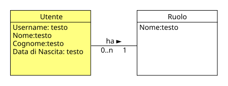

!!! info "Permessi e Ruoli"
    * **Gestisce (crea, modifica, elimina):** :material-account-hard-hat: Progettista
    * **Gestisce (solo modifica):** :material-shield-account: Moderatore
    * **Visualizza:** :material-account-hard-hat: Progettista, :material-shield-account: Moderatore

Nel progetto concettuale, un **Utente** rappresenta una persona con determinati attributi:

* **Username** :material-arrow-right-thin: rappresenta il token che l'utente utilizzerà per accedere al sistema
* **Nome** :material-arrow-right-thin: rappresenta il nome dell'utente
* **Cognome** :material-arrow-right-thin: rappresenta il cognome dell'utente
* **Data di nascita** :material-arrow-right-thin: rappresenta la data di nascita dell'utente

  

Dal punto di vista concettuale, l'utente è un "guscio vuoto" che non ha alcun significato senza un ruolo associato, per questo motivo a ognuno di essi viene associato un [Ruolo](role.md) che ne definisce le azioni che può compiere all'interno del sistema.

Il **Progettista:material-account-hard-hat:** si occupa di creare/modificare/eliminare gli **Utenti**, mentre il **Moderatore:material-shield-account:** può visualizzarli ed eventualmente aggiornare i loro dati anagrafici e certificazioni.

## Moodle
In Moodle, il concetto di Utente è uguale a quello del progetto concettuale.

> [!ATTENZIONE]
> Alcuni campi per la creazione di un utente sono obbligatori, come ad esempio l'email o la password, ma non sono presenti nel progetto concettuale, perché non sono necessari per il corretto funzionamento del sistema, per questo motivo il **Progettista:material-account-hard-hat:** dovrà eventualmente inserire un valore fittizio per questi campi. 

> [!ATTENZIONE]
>Alcuni campi non esistono perché Moodle non li prevede, come ad esempio la data di nascita, per questo motivo il **Progettista:material-account-hard-hat:** dovrà eventualmente creare un campo personalizzato per l'utente.

### Creare un campo personalizzato per l'utente
Un campo personalizzato permette di aggiungere ulteriori informazioni per l'utente che Moodle non prevede, ma che sono necessarie o previste dal progetto concettuale.

I passi sono:

1. Accedere alla pagina **Amministrazione del sito** di Moodle
1. Cliccare su **Utenti** nel menù centrale
1. Nella sezione **Profili** cliccare su **Campi personalizzati**
1. Nella pagina ci sarà una categoria di campi chiamata **Altri campi**, è possibile utilizzare questa categoria (eventualmente modificandone il nome) oppure crearne una nuova cliccando su **Crea una nuova categoria** e inserendo il nome della categoria
1. Cliccare nel menù a tendina **Crea un campo personalizzato** e selezionare il tipo di campo da creare (es. Data e ora, Testo, ecc.)
1. Nella pagina che si apre popolare i seguenti campi obbligatori:

    * **Nome** :material-arrow-right-thin: rappresenta il nome del campo che sarà visibile agli utenti
    * **Nome abbreviato** :material-arrow-right-thin: rappresenta l'identificativo del campo

1. (Opzionale) Mettere la spunta in **Compilazione obbigatoria** se si vuole che il campo sia obbligatorio per tutti gli utenti
1. Mettere la spunta in **Da compilare nella pagina di creazione account** se si vuole che il campo sia compilabile in fase di creazione dell'utente
1. Cliccare su **Salva modifiche** per terminare la creazione.

A questo punto, i campi personalizzati creati saranno visibili nella pagina di creazione dell'utente sotto la categoria in cui sono stati definiti (es. **Altri campi**).

> [!ESEMPIO]
> Un esempio di campo personalizzato potrebbe essere "Data di nascita", che permette di registrare la data di nascita degli utenti. 
> In questo esempio, **Nome** sarà `Data di nascita`, **Nome abbreviato** sarà `datanascita` e
> poichè il campo personalizzato è di tipo "Data e Ora", sarà possibile impostare un anno minimo e massimo per la data di nascita, in modo da evitare che vengano inseriti valori non validi.
> 

### Creare un nuovo utente

> [!TIP]
> È possibile creare più utenti contemporaneamente tramite un file CSV (vedi [Creare o aggiornare più utenti contemporaneamente](csv.md#creare-o-aggiornare-piu-utenti-contemporaneamente)).

I passi sono:

1. Accedere alla pagina **Amministrazione del sito** di Moodle
1. Cliccare su **Utenti** nel menù centrale
1. Nella sezione **Profili** cliccare su **Nuovo utente**
1. Inserire i seguenti campi di default obbligatori:
    
    * **Username** :material-arrow-right-thin: rappresenta il **token univoco** che l'utente utilizzerà per accedere al sistema
    * **Password** :material-arrow-right-thin: rappresenta la password assegnata all'utente (non sarà usata, vedi il plugin [Login](plugin.md#login))
    * **Nome** :material-arrow-right-thin: rappresenta il nome dell'utente
    * **Cognome** :material-arrow-right-thin: rappresenta il cognome dell'utente
    * **Indirizzo email** :material-arrow-right-thin: rappresenta l'indirizzo email dell'utente (dovrà essere un email fittizia)

1. Inserire eventuali campi personalizzati creati in precedenza (vedi [Creare un campo personalizzato per l'utente](#creare-un-campo-personalizzato-per-lutente))
1. Cliccare sul pulsante **Crea utente** in fondo alla pagina per terminare la creazione del nuovo utente.

> [!IMPORTANTE]
> Una volta creato il nuovo utente, il **Progettista:material-account-hard-hat:** dovrà assegnargli un [Ruolo](role.md) per permettergli di svolgere le azioni previste dal progetto concettuale (vedi [Assegnare o rimuovere un ruolo a un utente in Moodle](role.md#assegnare-o-rimuovere-un-ruolo-a-un-utente-in-moodle)).

### Modificare un utente

> [!TIP]
> È possibile modificare i dati di più utenti contemporaneamente tramite un file CSV (vedi [Creare o aggiornare più utenti contemporaneamente](csv.md#creare-o-aggiornare-piu-utenti-contemporaneamente)).

I passi sono:

1. Accedere alla pagina **Amministrazione del sito** di Moodle
1. Cliccare su **Utenti** nel menù centrale
1. Nella sezione **Profili** cliccare su **Elenco Utenti**
1. Cercare l'utente (eventualmente aiutandosi con la barra di ricerca), cliccare sul menù  e scegliere **Modifica **
1. Nella pagina che si apre modificare i campi desiderati e cliccare su **Aggiornamento profilo** in fondo alla pagina per terminare la modifica dell'utente.

### Eliminare un utente

> [!TIP]
> I passi successivi permettono di eliminare uno o più utenti alla volta

I passi sono:

1. Accedere alla pagina **Amministrazione del sito** di Moodle
1. Cliccare su **Utenti** nel menù centrale
1. Nella sezione **Profili** cliccare su **Azioni in massa**
1. Utilizzare i filtri per trovare l'utente da eliminare, evidenziare nel riquadro a sinistra l'utente da eliminare e cliccare sul pulsante **Aggiungi alla selezione** per spostarlo nel riquadro a destra
1. Scorrere in basso e nel menù a tendina scegliere come azione **Elimina** e cliccare sul pulsante **Vai** per procedere con l'eliminazione
1. Nella pagina che si apre, confermare l'eliminazione dell'utente cliccando sul pulsante **Sì**.
